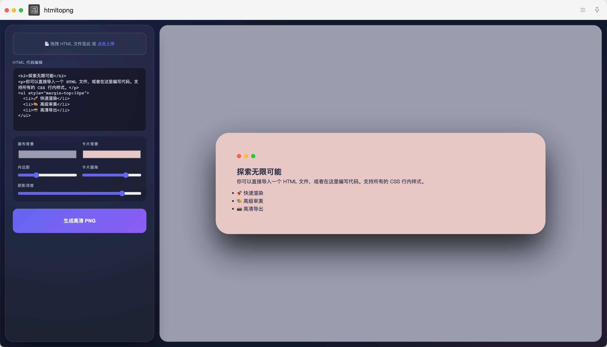
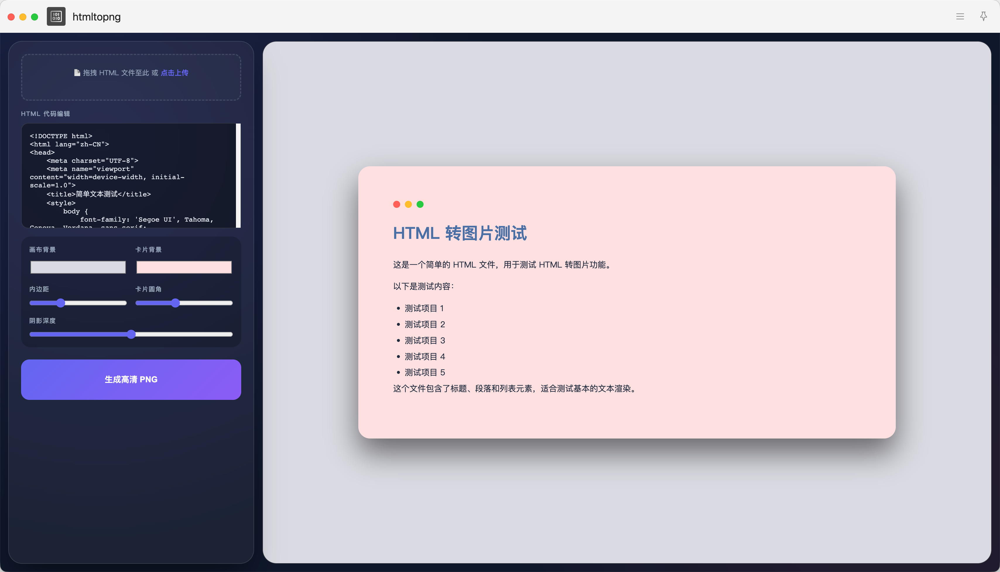
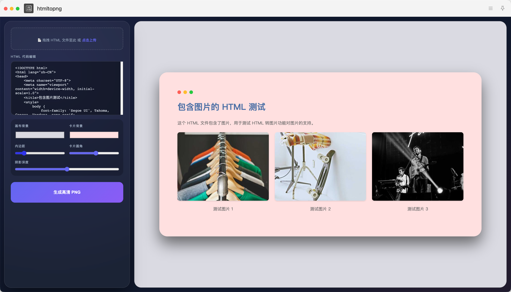
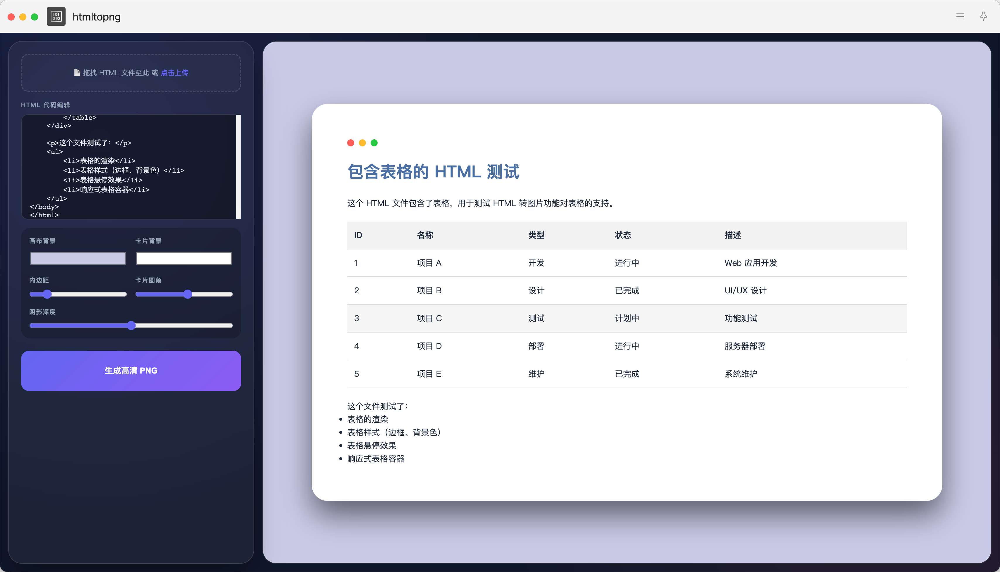

# HTML 转图片 uTools 插件

一个功能强大的 uTools 插件，用于将 HTML 代码或文件转换为高清图片。

## 功能特性

- 🎨 **现代界面**：采用 2025 年主流的暗黑模式、玻璃拟态和霓虹渐变风格
- 📄 **文件支持**：支持上传本地 HTML 文件或直接编写 HTML 代码
- 🖼️ **实时预览**：左侧编辑，右侧实时预览效果
- 🎯 **高度自定义**：可调整画布背景、卡片背景、内边距、圆角和阴影深度
- 📸 **高清导出**：支持 3 倍分辨率导出，确保图片清晰锐利
- 🖱️ **拖拽支持**：支持直接拖拽 HTML 文件到上传区域
- 🔄 **响应式设计**：窗口大小变化时，预览区自动调整

## 效果展示

### 界面预览

#### 效果 1

#### 效果 2

#### 效果 3

#### 效果 4

## 安装方法

1. 下载插件压缩包
2. 打开 uTools，进入插件中心
3. 点击「本地安装」，选择下载的压缩包
4. 安装完成后，在 uTools 输入框中输入 `html转图片` 即可使用

## 使用方法

### 方法一：直接编写 HTML 代码
1. 在左侧的 HTML 代码编辑框中输入或粘贴 HTML 代码
2. 调整右侧的预览效果
3. 点击「生成高清 PNG」按钮导出图片

### 方法二：上传 HTML 文件
1. 点击左侧的「点击上传」按钮，选择本地 HTML 文件
2. 或直接拖拽 HTML 文件到上传区域
3. 调整右侧的预览效果
4. 点击「生成高清 PNG」按钮导出图片

### 方法三：通过 uTools 快速打开
1. 在 uTools 输入框中输入 `html转图片`
2. 选择插件并回车
3. 开始使用

## 功能说明

- **画布背景**：设置整个预览区的背景颜色
- **卡片背景**：设置 HTML 内容卡片的背景颜色
- **内边距**：调整卡片与画布边缘的距离，最小值时卡片完全覆盖画布
- **卡片圆角**：调整卡片的圆角大小
- **阴影深度**：调整卡片的阴影效果

## 技术实现

- **前端框架**：React
- **构建工具**：Vite
- **核心库**：html2canvas
- **设计风格**：暗黑模式 + 玻璃拟态 + 霓虹渐变

## 注意事项

- 支持所有 CSS 行内样式
- 支持加载跨域图片（需开启 CORS）
- 导出的图片分辨率为预览区的 3 倍，确保高清效果
- 复杂的 HTML 结构可能会增加渲染时间

## 版本历史

- v1.0.0：初始版本，实现基本功能

## 贡献

欢迎提交 Issue 和 Pull Request，帮助改进这个插件！

## 许可证

MIT License